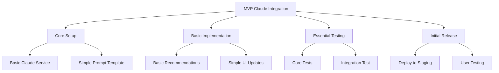

# Claude AI Integration Plan - MVP Focus

## MVP Scope

For the initial testable MVP, we will focus on:
1. Basic Claude API integration for lawn care advice
2. Simple prompt template for personalized recommendations
3. Essential UI updates to display AI insights
4. Core testing to ensure reliability

## Implementation Phases



### 1. Core Setup (Day 1)

#### Basic Claude Service
- Create `src/lib/claude.ts` with essential functionality:
  - Basic API client
  - Simple error handling
  - Minimal retry logic

#### Simple Prompt Template
- One core template for lawn care advice
- Focus on combining:
  - Lawn profile data
  - Current weather
  - Basic seasonal factors

### 2. Basic Implementation (Day 2)

#### Enhanced Recommendation System
```typescript
interface MVPRecommendation extends TaskRecommendation {
  aiAdvice: string;  // Single, focused piece of AI advice
  confidence: number; // Simple confidence score
}
```

#### Minimal UI Updates
- Add AI advice section to existing task recommendations
- Simple loading and error states
- Basic feedback mechanism

### 3. Essential Testing (Day 3)

#### Core Test Suite
- Basic API integration tests
- Simple prompt validation
- Key user flows
- Error handling verification

### 4. Initial Release (Day 4)

#### Staging Deployment
- Deploy to staging environment
- Basic monitoring setup
- Initial user testing

## MVP Success Criteria

1. Technical Requirements
   - Claude API successfully integrated
   - Response times under 3 seconds
   - Basic error handling working

2. Feature Requirements
   - AI provides relevant lawn care advice
   - Advice displayed in UI
   - Users can view recommendations

3. Testing Requirements
   - Core tests passing
   - Basic integration verified
   - Key user flows working

## Future Enhancements (Post-MVP)
- Advanced prompt templates
- More sophisticated UI integration
- Enhanced error handling
- Comprehensive testing
- Performance optimization
- Usage analytics

## Next Steps

1. Set up Claude API access
2. Create basic service implementation
3. Test core functionality
4. Deploy for initial testing

## Notes

- Keeping MVP scope minimal and focused
- Prioritizing testable functionality
- Deferring non-essential features
- Maintaining simple, reliable implementation