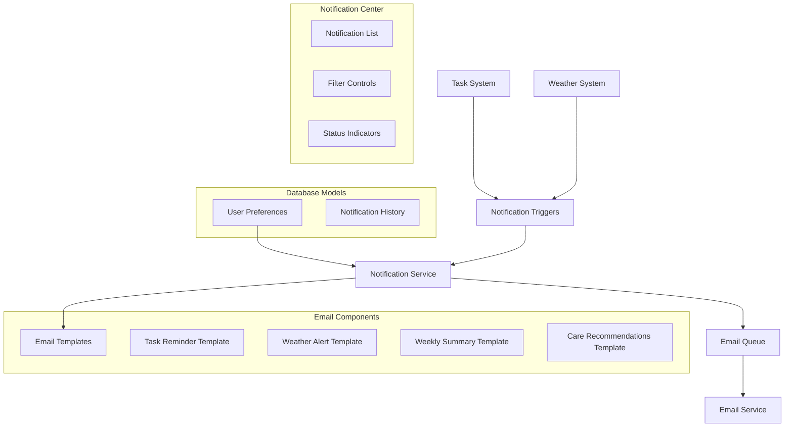

# Email Notification System Implementation Plan

## System Overview



## Implementation Phases

### Phase 1: Database Schema & Models
1. Add notification preferences to User model
   - Email notification types enabled/disabled
   - Time zone settings
2. Create NotificationHistory model
   - Track sent notifications
   - Store delivery status
   - Link to related entities (tasks, weather alerts)

### Phase 2: Email Service Integration
1. Set up Resend.com integration
   - Configure API keys
   - Set up environment variables
   - Create email service utility
2. Implement email templates using react-email
   - Task reminder template
   - Weather alert template
   - Weekly summary template
   - Care recommendations template

### Phase 3: Notification Center UI
1. Create notification center components
   - Notification list view
   - Filter controls
   - Status indicators
2. Implement notification preferences form
   - Enable/disable specific notifications
   - Configure time zone

### Phase 4: Queue System & Error Handling
1. Implement notification queue
   - Prevent email flooding
   - Handle retry logic
   - Track delivery status
2. Add error handling
   - Failed delivery handling
   - Retry mechanisms
   - Error logging
   - User feedback

### Phase 5: Testing & Monitoring
1. Unit tests
   - Template rendering
   - Trigger conditions
   - Queue processing
2. Integration tests
   - End-to-end email delivery
   - Preference updates
   - Notification center functionality

## Technical Specifications

### Database Schema Updates
```prisma
model User {
  // Existing fields...
  notificationPreferences NotificationPreferences?
  notificationHistory    NotificationHistory[]
}

model NotificationPreferences {
  id                    String   @id @default(cuid())
  userId               String   @unique
  user                 User     @relation(fields: [userId], references: [id])
  taskReminders        Boolean  @default(true)
  weatherAlerts        Boolean  @default(true)
  weeklySummary        Boolean  @default(true)
  careRecommendations  Boolean  @default(true)
  timezone             String   @default("UTC")
  createdAt            DateTime @default(now())
  updatedAt            DateTime @updatedAt
}

model NotificationHistory {
  id          String   @id @default(cuid())
  userId      String
  user        User     @relation(fields: [userId], references: [id])
  type        String   // task_reminder, weather_alert, weekly_summary, care_recommendation
  status      String   // sent, failed, delivered
  subject     String
  content     String
  metadata    Json?    // Additional context (task ID, weather data, etc.)
  createdAt   DateTime @default(now())
  updatedAt   DateTime @updatedAt
}
```

### Component Structure
- `/components/notifications/`
  - `NotificationCenter.tsx`
  - `PreferencesForm.tsx`
  - `NotificationList.tsx`
  - `NotificationFilters.tsx`
  - `EmailTemplates/`
    - `TaskReminder.tsx`
    - `WeatherAlert.tsx`
    - `WeeklySummary.tsx`
    - `CareRecommendations.tsx`

### API Routes
- `/api/notifications/`
  - `preferences.ts` (GET, PUT)
  - `history.ts` (GET)
  - `test.ts` (POST - development only)

## Future Extensions
- Email delivery scheduling system
- Read receipt tracking
- Click tracking analytics
- Advanced notification rules engine

## Success Criteria
1. Users can manage notification preferences
2. Email notifications are delivered reliably
3. Notification history is accessible in the UI
4. System handles errors gracefully
5. All core notification types are implemented
6. UI provides clear feedback on notification status

## Implementation Notes
- Use existing form patterns for preferences management
- Follow established error handling patterns
- Leverage existing authentication system
- Maintain consistent UI design with current components
- Implement proper loading states
- Ensure mobile responsiveness