# Weather Integration Implementation Plan

## Testing Strategy Diagram

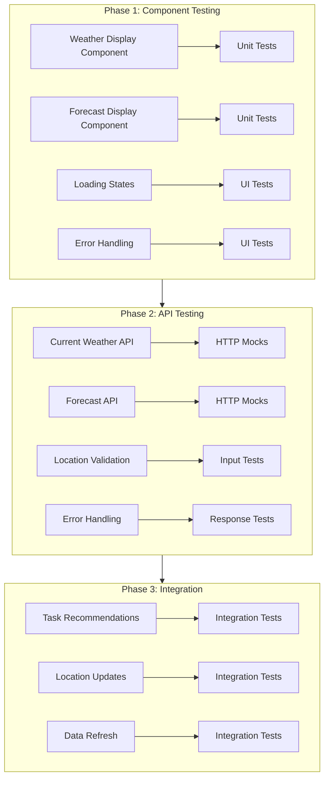

## Implementation Steps

### 1. Component Testing Setup
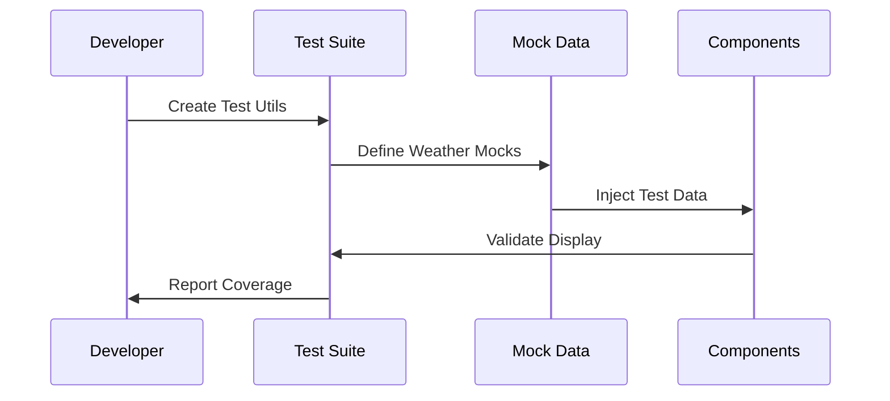

### 2. API Testing Flow
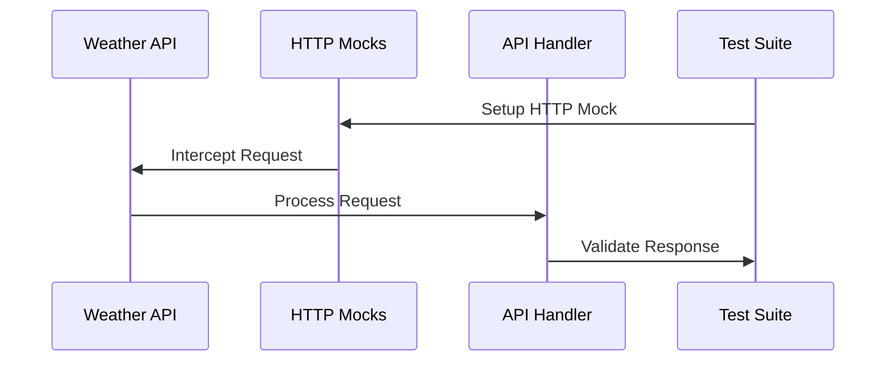

### 3. Integration Testing
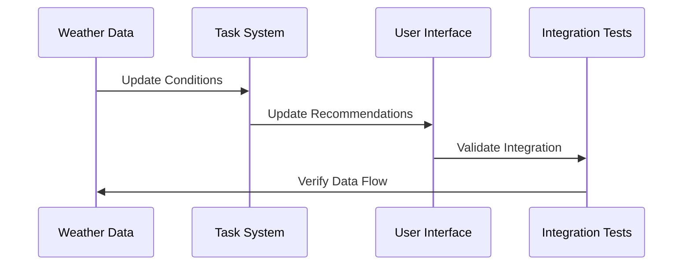

## Test Coverage Goals

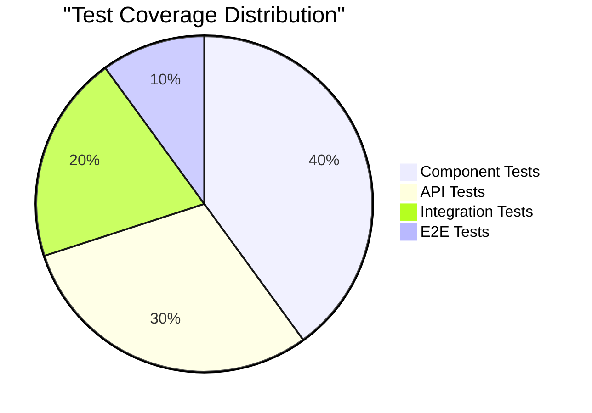

## Implementation Timeline

## Success Metrics

- [ ] Component test coverage > 80%
- [ ] API endpoint tests passing
- [ ] Error handling validated
- [ ] Location-based fetching tested
- [ ] Task recommendations verified
- [ ] Performance benchmarks met

# Calendar Implementation Plan

## Testing Strategy Diagram

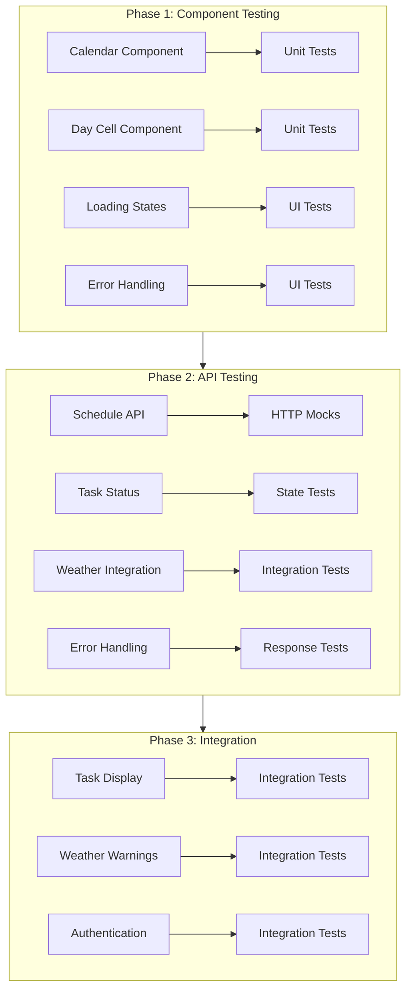

## Implementation Steps

### 1. Component Testing Setup
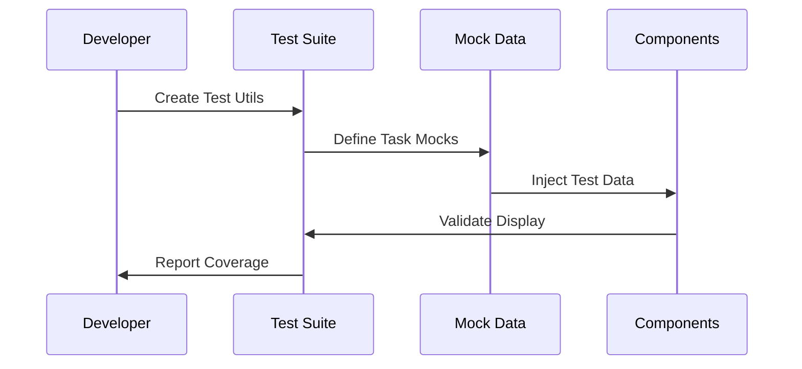

### 2. API Testing Flow
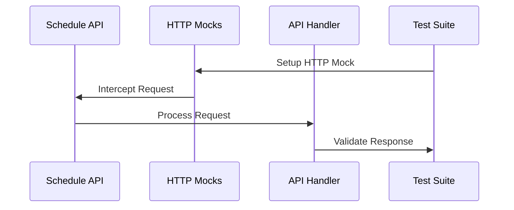

### 3. Integration Testing
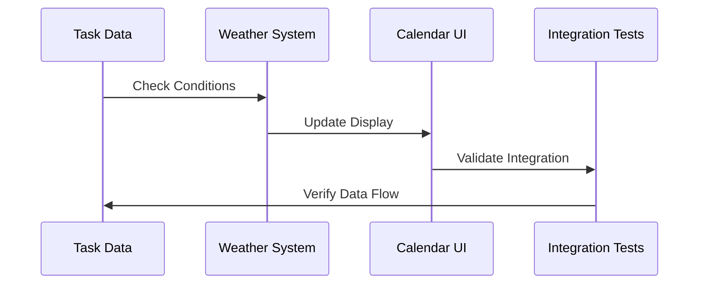

## Test Coverage Goals

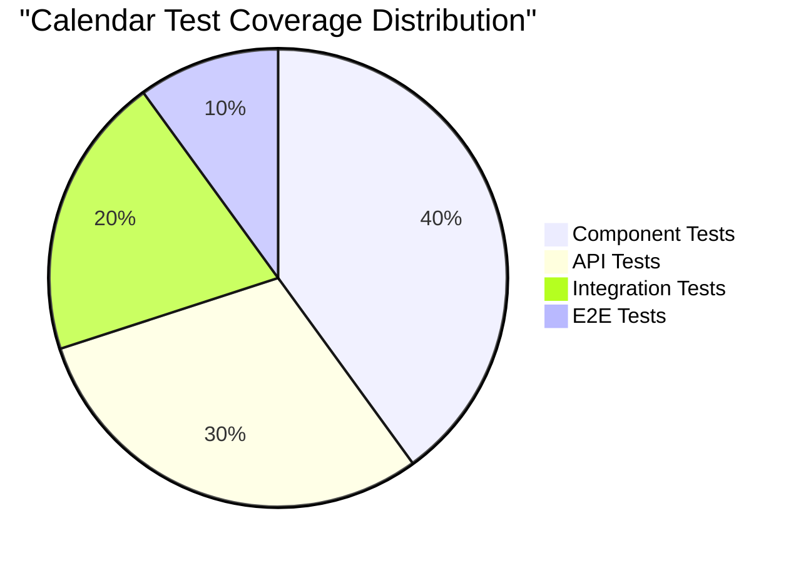

## Implementation Timeline

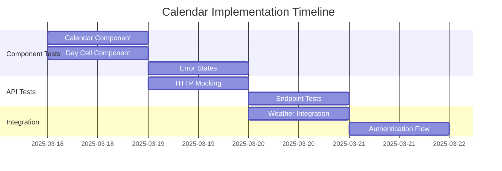

## Success Metrics

- [ ] Component test coverage > 80%
- [ ] API endpoint tests passing
- [ ] Error handling validated
- [ ] Authentication flow tested
- [ ] Weather integration verified
- [ ] Performance benchmarks met

## Next Actions

1. Update test utilities
2. Implement HTTP mocking
3. Add component tests
4. Validate API integration
5. Document test scenarios