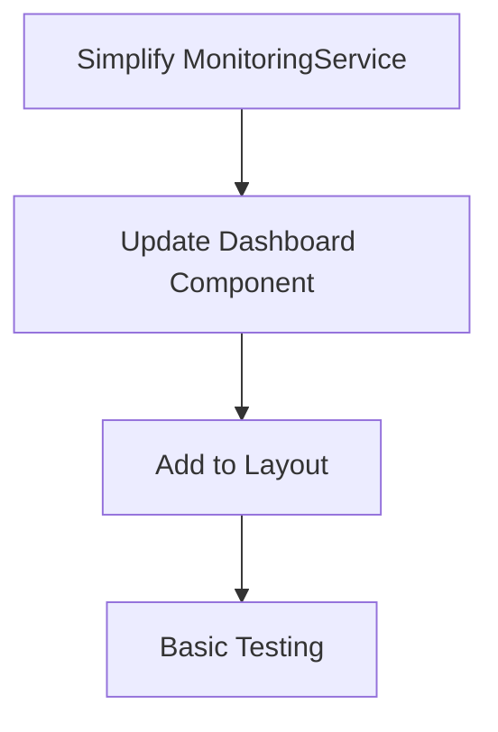

# Simplified Monitoring Implementation Plan

## Overview
We need to simplify the monitoring system to focus on MVP needs and remove unnecessary complexity.

## Current Issues
1. Complex real-time syncing causing URL issues
2. Over-engineered metrics storage and retrieval
3. Too many features for MVP needs

## Simplified Approach

### 1. Monitoring Service
- Remove real-time syncing
- Keep only in-memory stats (no database needed)
- Focus on core metrics:
  * Response times
  * Error counts
  * Cache stats

### 2. Dashboard Components
- Simple grid of cards showing:
  * Average response time
  * Total requests
  * Error count
  * Cache hit rate
- No real-time updates (page refresh only)
- No complex graphs for MVP

### 3. Implementation Steps

### 4. Files to Modify
1. src/lib/monitoring.ts
   - Remove syncing logic
   - Simplify to in-memory storage
   - Keep basic metric recording

2. src/components/monitoring/monitoring-dashboard.tsx
   - Simplify to basic stats display
   - Remove real-time updates

3. src/app/dashboard/monitoring/page.tsx
   - Update layout for simplified dashboard

### 5. Success Criteria
- [ ] Basic metrics are recorded correctly
- [ ] Dashboard displays current stats
- [ ] No URL or syncing errors
- [ ] Clean, simple UI for monitoring

## Future Enhancements (Post-MVP)
- Real-time updates
- Metric persistence
- Historical data
- Detailed graphs and charts
- Advanced analytics