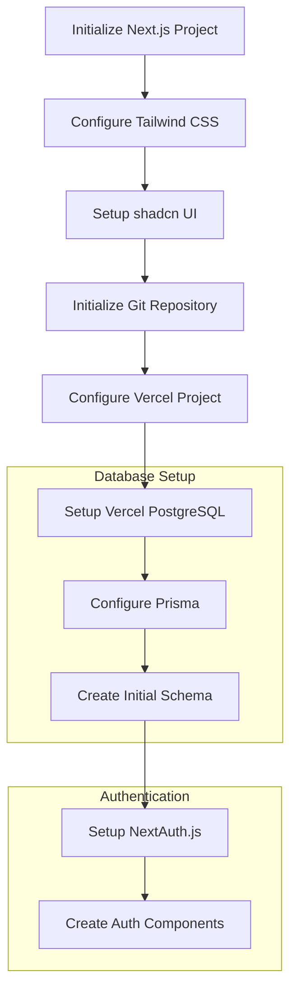

# LawnSync Implementation Plan - Day 1

## Overview
This document outlines the implementation plan for Day 1 of the LawnSync MVP development sprint, focusing on project foundation and authentication setup.

## Implementation Flow



## Detailed Steps

### 1. Project Initialization
- Create Next.js 14 project with App Router
- Configure Tailwind CSS
- Set up shadcn UI with their recommended configuration
- Initialize Git repository with proper .gitignore

### 2. Vercel & Database Setup
- Create new Vercel project
- Create Vercel PostgreSQL database
- Configure environment variables
- Set up Prisma with initial configuration
- Create base schema for users

### 3. Authentication Setup
- Install and configure NextAuth.js with Prisma adapter
- Create authentication components:
  * Sign In form
  * Sign Up form
  * Navigation bar with auth state
- Implement protected route middleware
- Set up error handling and loading states

### 4. Project Structure
```
src/
├── app/
│   ├── (auth)/
│   │   ├── signin/
│   │   └── signup/
│   ├── (protected)/
│   │   └── dashboard/
│   ├── layout.tsx
│   └── page.tsx
├── components/
│   ├── auth/
│   ├── layout/
│   └── ui/
├── lib/
│   ├── auth.ts
│   └── db.ts
└── styles/
    └── globals.css
```

### 5. Initial Prisma Schema
```prisma
model User {
  id        String   @id @default(cuid())
  email     String   @unique
  password  String
  name      String?
  createdAt DateTime @default(now())
  updatedAt DateTime @updatedAt
}
```

### 6. Environment Variables
```
DATABASE_URL=
NEXTAUTH_SECRET=
NEXTAUTH_URL=
```

### 7. Success Criteria for Day 1
- Next.js project runs locally with Tailwind CSS and shadcn UI
- Vercel PostgreSQL is connected and Prisma can query the database
- Users can sign up and sign in
- Protected routes work as expected
- Git repository is initialized with proper structure
- Project can be deployed to Vercel

## Implementation Notes
- Using Next.js 14 with App Router for modern React features
- Implementing shadcn UI for consistent component design
- Setting up Vercel PostgreSQL from the start for dev/prod parity
- Following Next.js best practices for authentication and routing
- Establishing scalable project structure for future development