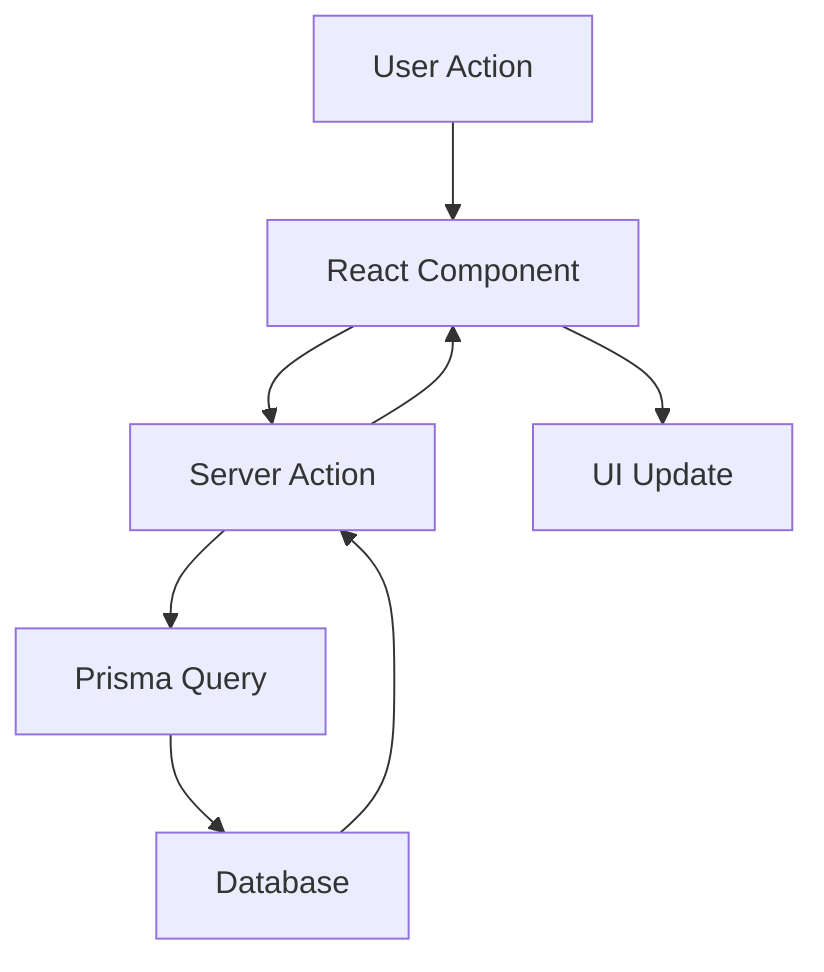

# System Patterns

## Development Patterns

### Code Organization
```
src/
├── app/                 # Next.js app directory
│   ├── api/            # API routes
│   ├── auth/           # Authentication pages
│   ├── dashboard/      # Dashboard pages
│   └── profile/        # Profile pages
├── components/         # React components
│   ├── ui/            # shadcn UI components
│   ├── forms/         # Form components
│   ├── weather/       # Weather components
│   └── tasks/         # Task components
├── lib/               # Utility functions
├── styles/            # Global styles
└── types/             # TypeScript types
```

### Naming Conventions
- **Files**: kebab-case (e.g., `lawn-profile.tsx`)
- **Components**: PascalCase (e.g., `WeatherCard`)
- **Functions**: camelCase (e.g., `getWeatherData`)
- **Types/Interfaces**: PascalCase (e.g., `LawnProfile`)
- **Constants**: UPPER_SNAKE_CASE (e.g., `API_ENDPOINT`)

### Error Handling
```typescript
try {
  // Operation that might fail
  await someOperation()
} catch (error) {
  if (error instanceof PrismaError) {
    // Handle database errors
  } else if (error instanceof ApiError) {
    // Handle API errors
  } else {
    // Handle unexpected errors
  }
}
```

### Testing Patterns
```typescript
describe('Component/Feature', () => {
  beforeEach(() => {
    // Setup
  })

  it('should handle expected behavior', () => {
    // Test
  })

  it('should handle error cases', () => {
    // Test
  })
})
```

## Architecture Patterns

### Application Structure
- Server-side rendering for initial loads
- Client-side navigation for smooth transitions
- API routes for data operations
- Protected routes for authenticated content

### Data Flow


### Integration Patterns
- OpenWeatherMap API wrapper with caching
- Claude API service for recommendations
- NextAuth.js for authentication flow
- Prisma client for database operations

## Design Patterns

### UI/UX Patterns
- Mobile-first responsive design
- Progressive enhancement
- Consistent component spacing
- Error state handling
- Loading state indicators

### State Management
- React Context for global state
- Local state for component-specific data
- Server state with React Query
- Form state with react-hook-form

### API Design
- RESTful endpoints for CRUD operations
- Server actions for form submissions
- Typed API responses
- Consistent error formats

## Documentation Patterns

### Code Documentation
```typescript
/**
 * Component description
 * @param props - Component props
 * @param props.title - Title description
 * @returns JSX element
 */
```

### Commit Messages
```
type(scope): description

[optional body]

[optional footer]
```
Types: feat, fix, docs, style, refactor, test, chore

### Pull Requests
```markdown
## Description
Brief description of changes

## Changes
- Detailed list of changes
- With supporting context

## Testing
- [ ] Unit tests
- [ ] Integration tests
- [ ] Manual testing steps

## Screenshots
[If applicable]
```

## Notes
- Patterns will be enforced through ESLint/Prettier
- TypeScript for type safety
- Automated testing in CI pipeline
- Regular pattern reviews and updates