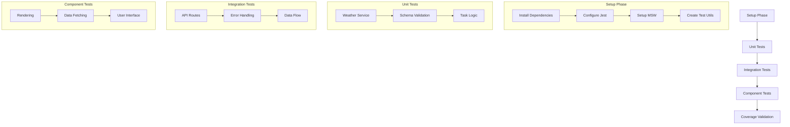

# Test Strategy Approval

## Overview
The proposed test strategy for weather integration has been reviewed and is approved with the following notes and recommendations.

## Strategy Alignment
The strategy aligns well with our:
1. System patterns and architecture
2. MVP requirements
3. Quality standards
4. Development workflow

## Coverage Goals
The proposed coverage targets are approved:
- Unit Tests: 90% ✓
- Integration Tests: 80% ✓
- Component Tests: 85% ✓

These targets balance thorough testing with MVP timeline constraints.

## Implementation Flow

## Recommendations

### 1. Test Infrastructure
- Use Jest with ts-jest for TypeScript support
- Configure MSW for API mocking
- Set up testing utilities early
- Add test scripts to package.json

### 2. Test Organization
- Mirror source directory structure
- Use consistent naming patterns
- Group related tests in describe blocks
- Use clear test descriptions

### 3. Test Data Management
- Create shared test fixtures
- Use type-safe mock data
- Maintain test data in separate files
- Document data scenarios

### 4. CI Integration
- Add test job to CI pipeline
- Configure coverage reporting
- Set up test caching
- Add status checks for PRs

## Success Metrics
1. All test suites passing
2. Coverage goals met
3. CI pipeline integration complete
4. Edge cases covered
5. Documentation updated

## Next Steps
1. Switch to Code mode to:
   - Set up test infrastructure
   - Configure test environment
   - Add test dependencies

2. Return to Test mode to:
   - Implement test suites
   - Validate coverage
   - Document results

## Approval
✓ Test strategy is approved for implementation
✓ Coverage goals are accepted
✓ Implementation plan is validated
✓ Resource requirements are confirmed

## Notes
- Focus on critical paths first
- Use realistic test data
- Document any deviations
- Regular progress updates