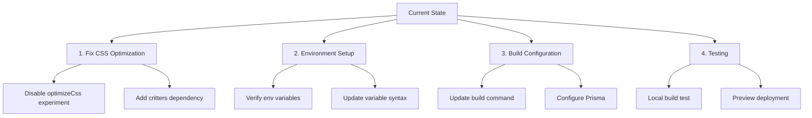

# Vercel Deployment Plan

## Current Issues
- Missing 'critters' module causing build failure
- CSS optimization configuration needs adjustment
- Environment variable setup needs verification

## Implementation Plan



## Detailed Steps

### 1. Fix CSS Optimization
- Remove experimental optimizeCss flag from next.config.js
- Add critters as a dependency: `npm install --save-dev critters`
- Keep the built-in CSS handling we set up earlier

### 2. Environment Setup
- Verify all required environment variables are set in Vercel:
  ```
  DATABASE_URL
  DIRECT_URL
  NEXTAUTH_SECRET
  OPENWEATHER_API_KEY
  RESEND_API_KEY
  CLAUDE_API_KEY
  ```
- Use ${VARIABLE_NAME} syntax in vercel.json
- Ensure separate values for Preview and Production environments

### 3. Build Configuration
- Update build command to handle Prisma and Next.js build
- Ensure Prisma client generation happens before build
- Configure proper database URLs for each environment

### 4. Testing
- Test build locally first
- Deploy to preview environment
- Verify all features work correctly

## Success Criteria
1. Build completes successfully without CSS optimization errors
2. Environment variables are properly accessed
3. Database migrations run successfully
4. Preview deployment works as expected

## Implementation Notes
- Changes will be made in Code mode
- Each step will be tested before proceeding
- Rollback plan in case of issues