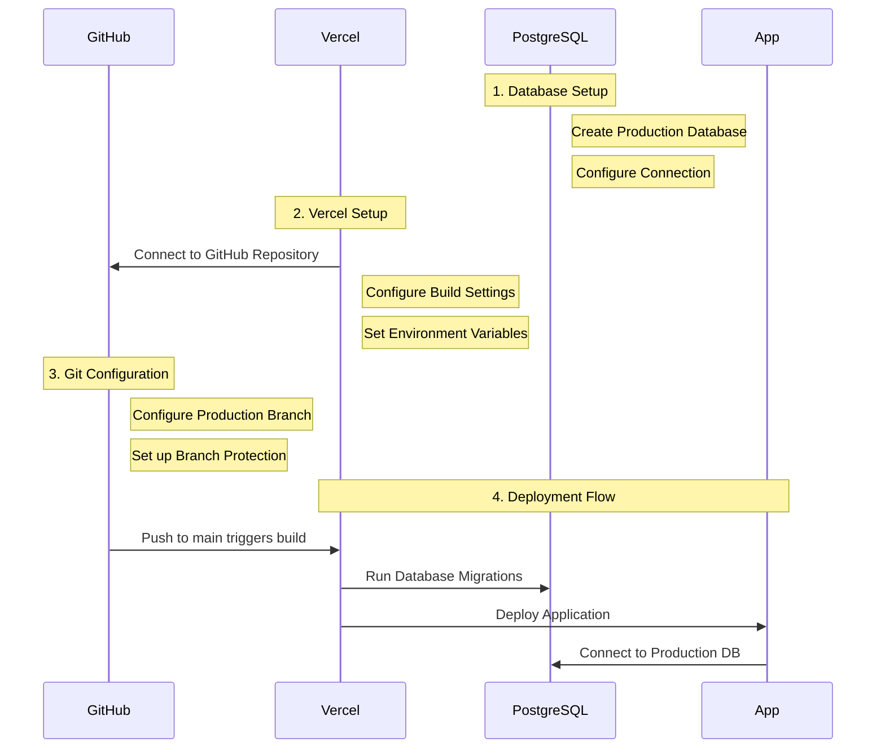

# Vercel Deployment Plan

## Overview
This document outlines the plan for deploying our Next.js application to Vercel with automatic deployments from GitHub.

## Deployment Flow



## Implementation Steps

### 1. Database Setup
- Create a production PostgreSQL database (recommended: Neon, Supabase, or Railway)
- Get the production database connection string
- Update schema and run migrations

### 2. Environment Variables Configuration
Required variables:
```
DATABASE_URL=production-db-url
OPENWEATHER_API_KEY=production-key
RESEND_API_KEY=production-key
CLAUDE_API_KEY=production-key
NEXTAUTH_URL=https://your-production-domain
NEXTAUTH_SECRET=generated-secret
```

### 3. Vercel Project Setup
- Connect GitHub repository (https://github.com/tlagaly/lawnsync-app)
- Configure build settings:
  - Framework Preset: Next.js
  - Build Command: `npm run build`
  - Install Command: `npm install`
  - Output Directory: `.next`

### 4. Automatic Deployment Configuration
- Configure production branch (main/master)
- Set up branch protection rules
- Configure automatic preview deployments for PRs

### 5. Database Migration Strategy
- Add build command to run migrations during deployment
- Configure Prisma for production environment

### 6. Post-Deployment Verification
- Database connection check
- API endpoint verification
- Authentication flow testing
- Email service verification

## Success Criteria
- [ ] Production database is set up and accessible
- [ ] All environment variables are configured in Vercel
- [ ] GitHub repository is connected to Vercel
- [ ] Automatic deployments are working
- [ ] Database migrations run successfully
- [ ] All API endpoints are functional
- [ ] Authentication system works in production
- [ ] Email notifications are being sent correctly